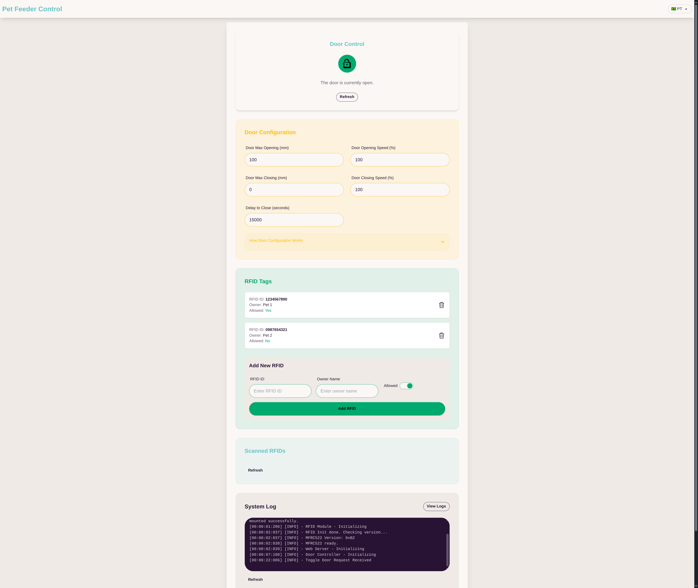

# 🐾 Petsense Feeder

## 🧰 Materials Required
- **ESP8266** ⚡  
    - [Arduino ESP8266 Package](http://arduino.esp8266.com/stable/package_esp8266com_index.json)
- **RFID RC522** 📡
- **Servo Motor** ⚙️

## 🔌 Plugins
- **MRFC522** by GitCommunity 🏷️
- **Ticker** by stefan staub
- **LittleFS** 🗂️  
    - [LittleFS Plugin](https://github.com/earlephilhower/arduino-littlefs-upload/)


## Recommended Plugins

### 🛠️ Installing LittleFS Plugin

To install the LittleFS plugin, use one of the following commands:

```sh
# Using wget 🐧
wget https://github.com/earlephilhower/arduino-littlefs-upload/releases/download/1.5.4/arduino-littlefs-upload-1.5.4.vsix

# Using curl 🌐
curl -LO https://github.com/earlephilhower/arduino-littlefs-upload/releases/download/1.5.4/arduino-littlefs-upload-1.5.4.vsix

# Move to the folder
mv arduino-littlefs-upload-1.5.4.vsix ~/.arduino15/plugins/
```

### 🛠️ Installing Exception Decoder
```sh
# Using wget 🐧
wget https://github.com/dankeboy36/esp-exception-decoder/releases/download/1.1.0/esp-exception-decoder-1.1.0.vsix

# Using curl 🌐
curl -LO https://github.com/dankeboy36/esp-exception-decoder/releases/download/1.1.0/esp-exception-decoder-1.1.0.vsix

# Move to the folder
mv esp-exception-decoder-1.1.0.vsix ~/.arduino15/plugins/
```


## App Config

1. Create the file wifi.h(more details bellow)
2. Upload /data using littleFS
3. Upload the application
4. Access the configuration page in your web browser.


### Create in root folder the file "wifi.h" with following content:
```cpp
    #ifndef WIFI_H
    #define WIFI_H

    const char* ssid = "<SSID>";
    const char* password = "<WIFIP ASSWORD>";

    #endif // WIFI_H
```


## 🚀 MVP Features
- **WiFi Access Point** 📶
- **Web Server** 🌍  
    - Servo Configuration ⚙️  
    - RFID Registration 🏷️  
    - System Logs 📜
- **RFID Scanner** 🔍
- _(More pawsome features coming soon!)_ 🐕🐈


## 🖼️ App Demo



*Screenshot of the Petsense Feeder web interface, showing the dashboard for servo configuration, RFID tag registration, and system logs, accessible via WiFi from any device.*


